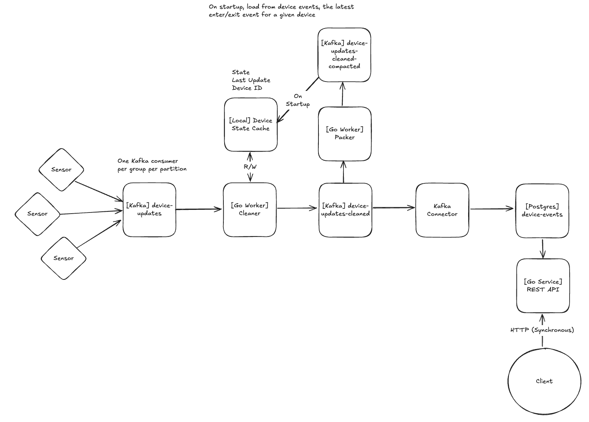

# Ubiety Senior Backend Home Assessment
Hi Ubiety team, thanks so much for considering me for this role! This repo is the solution source code for the provided project spec.

## Running Locally
### Requirements
- `make` - For running commands in the Makefile
- `docker` - For running the docker compose dependencies
- `go` - For running tests or scripts
### Commands
- `make up` - Start the whole docker compose file, including the main application
- `make down` - Teardown all docker compose containers, including their volumes
- `make test` - Run unit tests
- `make e2e` - Run an AI generated e2e test

    
## Overview
To get us started, here is an overview of how this system is structured.

The dependencies are as follows:
- Main Application - This is where the two workers (Cleaner and Packer), as well as the REST API live. The three services live in separate worker groups in a single Go application. 
    - The Cleaner is in charge of moving messages from the `device-events` Kafka topic to the `device_events_cleaned` Kafka topic. When the Cleaner consumes an event from `device-events`, it validates the event against the requirements in the project spec (no duplicates, `device_exit` and `device_enter` only). Events that fail validation are discarded. The Cleaner also attaches schema to the new messages in `device_events_cleaned`. This is necessary for Kafka Connect to work properly.
    - The Packer is in charge of moving messages from `device_events_cleaned` to `device_events_cleaned_compacted`, which is a compacted topic that only keeps the latest events for each device ID.
    - The Cache is used in the Cleaner and stores the last event seen and last timestamp seen (presently unused) for each device ID. The Cache is a simple local cache that is not thread safe. When the Main Application starts up, the Cache consumes all events from the `device_events_cleaned_compacted` topic and stores them in a map of Device ID -> Latest State. This ensures that if the Main Application goes down, it will not ingest incorrect events when it starts back up due to lack of valid device state. Once the cache is hydrated, the Cleaner instance that contains the cache is responsible for keeping it updated.
    - The REST API implements the `POST /timeline` and `GET /timeline/{device_id}` endpoints. `POST /timeline` accepts any event for any device ID with the timestamp in RFC3339 format (this is converted to Unix Epoch Milliseconds before storing to the database). `GET /timeline/{device_id}?start=start_timestamp&end=end_timestamp` will return all of the events for a device ID between the provided start and end timestamp.
    - The database layer is responsible for storing and querying data in the TimescaleDB database. Migrations are run automatically when the database pool is initialized via `go-migrate`. At present there is only one migration to create the `device_events_cleaned` table and convert it to a time-series optimized Hypertable.
- TimescaleDB (Postgres) - TimescaleDB is a Postgres plugin that is optimized for time-series data. There is one Hypertable (a table partitioned by timestamp) called `device_events_cleaned`.
    - An efficient time-series database is not necessary for this small toy project, and database would do fine, but at scale, a dedicated time-series DB is necessary.
- Kafka - The Kafka container and its associated containers.
    - The Kafka container has three topics:
        - `device-events` - Provided
        - `device_events_cleaned` - Events that adhere to the spec requirements, with schema attached
        - `device_events_cleaned_compacted` - Identical to `device_events_cleaned` but with a compaction cleanup policy
    - The `kafka-ui` container provides a UI for Kafka topics and messages at `localhost:10015`
    - The `kafka-init-topics` one-shot container creates all topics once the `kafka` container is ready
    - Kafka is running with one broker, one partition and one replica per partition. In a real system, we would need metrics to monitor throughput of these topics and scale up all as necessary.
- Kafka Connect - Kafka Connect is an out-of-the-box DB connector in charge of moving data from `device_events_cleaned` to TimescaleDB
    - `.jar` files and configuration for the Postgres Kafka Connector can be found in the `kafka-connect` directory
    - The `kafka-connect-init` is a one-shot docker compose container responsible for loading the config into the connector

### Testing
The main application containers a full suite of unit tests. Unit tests include:
- Table Tests - Writing all test cases in a list and executing them in a loop, reduces boilerplate setup for tests
- `go-mockery` - Automatically generate mock files from interfaces for use in unit tests
- `testcontainers` - Create a temporary container for use in tests, used in the database layer

The main application also contains a e2e test in `scripts/e2e`. This test writes all of the events in `events.json` to the `device-events` kafka topic, waits a fixed amount of time, then loads the timeline for each device from the REST API, and compares the received timelines against the expected timelines for each device. This e2e test is fairly flimsy and could certainly be improved in future project iterations.

## Quick Callouts
I wanted to make a quick callout that I changed up some of the provided source files.
1. `docker-compose-kafka.yml` -> `docker-compose.yml`
    - Removed the `wurstmeister` Zookeeper and Kafka images in favor of the official Confluent images. The `wurstmeister` images don't appear to have builds for ARM64 (`docker compose inspect wurstmeister...` returns nothing), which is what I am using, so the project would not startup.
    - Added other dependencies, these will be described in the Dependencies section.
    - Moved the `device-events` Kafka topic instantiation to a one-shot `kafka-init-topics` container.
2. `data-producer.py` -> `provided/data-producer.py`
    - No changes
3. `events.json` -> `provided/events.json`
    - No changes
4. `events_producer.sh` -> `provided/events_producer.sh`
    - Removed the `docker compose up` commands
5. `README.md` -> `provided/README.md`
    - No changes
6. `requirements.txt` -> `provided/requirements.txt`
    - No Changes

## Assumptions
- One consumer per consumer group per partition for all Kafka topics
    - `sync.Map` for a local cache is not necessary 
- One processor (Goroutine) per consumer
- Timestamps are reliable
- Events in Kafka topic are ordered correctly
- Events are reliably delivered
- There is only one device per sensor area at a time

## Future Work
- OTEL, logs, traces, metrics (especially throughput and response time percentiles)
- Scale up Kafka partitions, it is hard to move data to a different partition, can never downscale partitions
- Partition on device ID?
- All Kafka handlers at present are susceptible to the poison pill problem, this needs fixing
- waitForBrokers should be expanded to all workers, brokers may not be the same
- Broker strings should be checked to work with multiple brokers
- Scale up brokers
- DB migrator needs to handle rollbacks
- Local cache should be moved to a distributed cache (Redis)
- Handle unreliable clocks
- Sending config to the Kafka connector with `curl` is cumbersome, can we get rid of the one-shot and load it automatically?
- e2e test should be much better, cleaner, easier to change and expand
- How can we build a complete timeline if events are not delivered in-order?